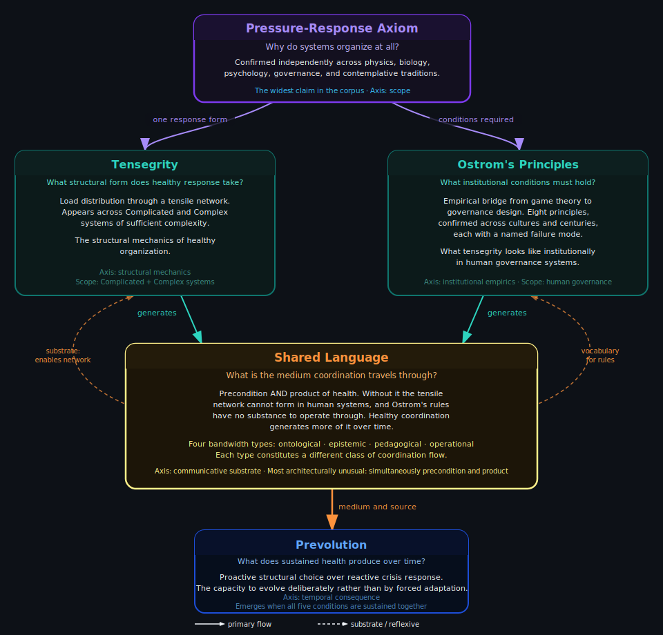
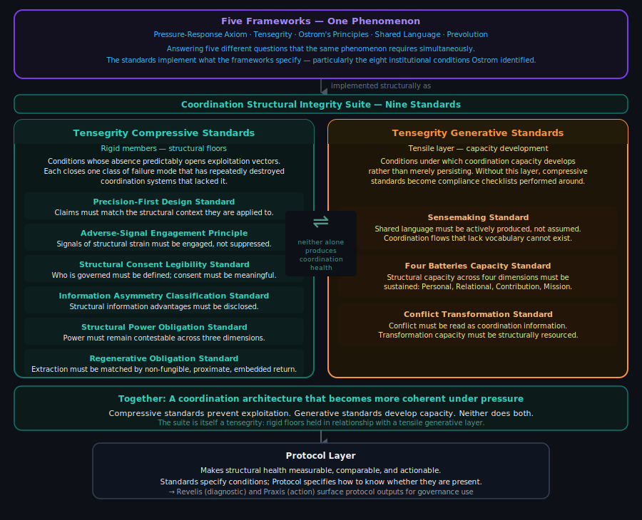
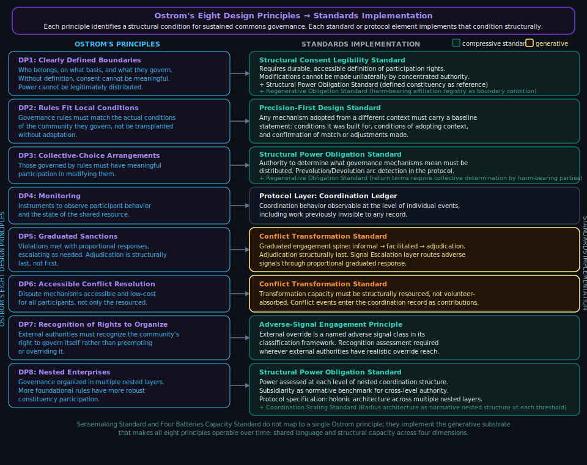

# Coordination Structural Integrity Suite

Distributed governance is struggling to find solid footing. Decentralized Autonomous Organizations (DAOs) and other coordination experiments have failed not because participants were malicious or incompetent, but because the systems lacked structural foundations. These standards specify those foundations.

This repository contains nine standards developed in the course of building the Proof of Coordination protocol: six Tensegrity Compressive Standards and three Tensegrity Generative Standards. Together they form the Coordination Structural Integrity Suite of the protocol's normative architecture.

## Start here: AI prompts and Claude skills

The Coordination Structural Integrity Suite covers a lot of ground. The architecture is intentionally broad because coordination failures are genuinely diverse and the suite is designed to address them structurally rather than symptomatically. That breadth can make it hard to know where to begin.

**AI prompts and Claude skills are the primary way to navigate this suite.** They are not supplemental tools — they are the designed entry point. The documentation in this repository is reference material that supports the prompts. The prompts carry everything an AI assistant needs to help you make sense of your situation and find the right instrument for it.

**Two entry paths.**

If you are new to the suite, want to understand whether it applies, or want to orient yourself before committing to a formal process: use the **[Explore the Coordination Structural Integrity Suite prompt](tensegrity-suite/prompts/suite/suite-explore-coordination-structural-integrity-suite-0_1_0.md)**. Paste it into any AI assistant (Claude, ChatGPT, Gemini, or similar), describe your organization and situation in plain language, and it will orient you to what the suite is, identify the structural class of your situation, and route you to the right instrument — with an explanation of why. It produces an exploration findings document you can save and carry forward.

If you want to formally assess your organization's structural health across all nine standards and produce a gap map and advancement roadmap: use the **[Coordination Structural Integrity Suite Assessment](tensegrity-suite/prompts/suite/suite-assessment-stage-1-orientation-0_1_0.md)**. This is a five-stage structured process. Each stage produces a downloadable output. Start with Stage 1, which orients you to the full process before any assessment begins. The assessment works best after completing the Explore prompt — it builds on the vocabulary and self-knowledge the exploration develops.

All prompts are in the `tensegrity-suite/prompts/` folder. The **[prompts README](tensegrity-suite/prompts/prompts-README.md)** maps every prompt by type and use case, including the full Coordination Structural Integrity Suite Assessment stage sequence. For extended reasoning work with an AI assistant that already has access to your documents and tools, **Claude skills** are in the `skills/` subfolders — they encode the full reasoning frame for each document and for the suite as a whole.

<p align="center">

</p>

## Repository structure

```
tensegrity-suite/             Coordination Structural Integrity Suite
  overview/                   suite-level documents: architecture, primer, integration guide,
                              deployment contexts
  prompts/                    AI prompts — primary orientation and navigation layer
    suite/                    triage prompt (Where Do I Start?) + suite-wide audit prompts
    tensegrity-architecture/  orientation prompt
    structural-patterns-primer/  pattern recognition prompt
    integration-guide/        adoption sequencing prompt
    deployment-contexts/      combination selection prompt
    conflict-transformation-preconditions/  operational readiness prompt
    six-v/                    Six-V Trust Framework application guide
    [per-standard subfolders] one subfolder per standard
  skills/                     Claude skills — suite-level, triage, and suite-document skills
  compressive/                six Tensegrity Compressive Standards
    standards/                the standard documents
    specifications/           companion specifications
    prompts/                  AI audit prompts, one subfolder per standard
    skills/                   Claude skills, one file per standard
  generative/                 three Tensegrity Generative Standards
    standards/                the standard documents
    prompts/                  AI capacity-development prompts, one subfolder per standard
    skills/                   Claude skills, one file per standard
```

## What these standards are

Coordination systems fail in predictable ways. The failures are structural: they happen because the systems lack structural floors, minimum conditions that, when absent, make exploitation and degradation predictable rather than merely possible.

The compressive standards specify those floors. Each standard in this repository is an instrument: a standalone specification of a structural requirement with verifiable conditions. They are not prescriptive workflows, style guides, or evaluation rubrics. The compressive standards specify what must not be violated; the generative standards specify what must be structurally present for coordination capacity to develop and be sustained. Neither type specifies how to organize.

## What these standards are not

The compressive standards are not complete coordination infrastructure on their own. They close exploitation vectors and prevent specific failure modes. Structural floors alone are not enough. A coordination system also needs generative capacity: the conditions under which participants can develop shared understanding and sustain the structural floors as coordination instruments rather than compliance checklists. The three Tensegrity Generative Standards in this repository address that generative layer.

Partial adoption is legitimate. Partial adoption claimed as full conformance is not. The adoption architecture section below specifies the three adoption categories and the structural exposure disclosure requirement for systems that claim accountability without holding the full Tensegrity Compressive Standards designation.

These standards do not specify governance outcomes. They specify structural conditions. What organizations do within those conditions is outside their scope.

## Who these standards are for

Every governance system that has failed believed it was adequate before it failed. FTX had governance documentation. Terra/Luna had economic theory. GravityDAO had values and processes. Every DAO that required emergency conflict transformation had a community that believed it had a community. The belief that structural failure modes do not apply to a specific system is not irrational from inside that system: it is the predictable output of the mechanisms those failure modes create. Organizations experiencing structural blindness do not experience it as blindness. They experience it as clarity.

These standards are designed primarily for organizations that do not currently believe they have a structural problem. Organizations already in crisis can use them, but the organizations most likely to benefit are the ones convinced they are doing governance correctly.

The reason is structural. The failure modes these standards address are most dangerous in the phase before they are visible. Structural power concentrates gradually, through drift, before it becomes capture. Consent erodes through accumulated friction before it becomes coercion. Adverse signals accumulate as dismissed noise before they become the record of a foreseeable failure. None of the protective work these standards enable is available after the failure is apparent. It is only available before.

Adopting these standards is not primarily an act of self-protection. It is a structural health claim made to others: funders, governance participants, counterparties, and future members who need to evaluate whether your coordination infrastructure is sound. An organization at any adoption tier has publicly verifiable evidence of its structural health, not a private belief that things are fine. That distinction matters most to the people evaluating from outside, and it holds regardless of what the organization believes about its own risk profile.

The "it won't happen to us" assumption is not something these standards argue against. It is something these standards make structurally legible. An organization with adoption-tier evidence demonstrating its power distribution, adverse signal engagement, and consent architecture has answered the question from its structure rather than from its confidence.

## The six Tensegrity Compressive Standards

**Precision-First Design Standard:** Requires that every element of a governed system increase the precision with which the system's dynamics can be observed, classified, and acted upon. Closes the gap between what a coordination system says it does and what it structurally does. Nine corollaries. Addresses Ostrom's second design principle at the standards level.

**Adverse-Signal Engagement Principle Core Standard:** Requires engagement with signals that contradict current models rather than suppression or reframing. Closes the gap between appearing to address problems and actually addressing them. Addresses Ostrom's design principles 5, 6, and 7 at the standards level.

**Structural Consent Legibility Standard:** Requires that consent to participation be structurally distinguishable from consent to specific terms, outcomes, and power arrangements. Three consent features: negotiated limits, bidirectional awareness, revocability. Addresses Ostrom's first design principle at the standards level.

**Information Asymmetry Classification Standard:** Requires classification and disclosure of the structural types of information asymmetry present in a coordination system. Six primary classes: positional, temporal, interpretive, relational, omission, complexity. Extension class framework for additional classes; Descriptive Capacity Asymmetry (differential linguistic-epistemic-ontological frameworks creating pre-interpretive perception gaps) is the first fully specified extension class.

**Structural Power Obligation Standard:** Requires that structural power arrangements be legible and contestable by participants who hold less of it. Three dimensions: coordination, authority, specialization. Addresses Ostrom's design principles 1, 3, and 8 at the standards level; cross-boundary detection architecture for DP8 remains an open design question.

**Regenerative Obligation Standard:** Requires that extraction of contributor capacity (labor, attention, knowledge, legitimacy) be matched by regenerative return satisfying three conditions simultaneously: non-fungibility (return must operate in the register of the harm, not a substitute register chosen by the extracting party), proximity (return must flow through a traceable causal chain to the parties who bear the harm, verified against a harm-bearing affiliation registry), and embeddedness (return must operate within the relational structure generated by the extraction obligation, not severed by market substitution or disconnected pooling). Any instrument using additionality logic or Social Return on Investment (SROI) aggregation is a categorical disqualifier for the proximity condition. Organizations adopting the standard must declare a stance (non-extractive, or more regenerative than extractive) and register harm-bearing affiliations. The standard addresses the Hidden Factory failure mode: when an organization reaches Stage D and continues extracting the output of a contributor's hidden factory without recognition or integration, that is the extraction this floor exists to prevent. The visibility condition requires that extraction be registerable, not only recorded. Two suppression types are structurally distinct: Step 01-formation (distorted normal baseline from growing up inside extraction) and identity fusion (the Stage D-E mechanism where the contributor's sense of worth has become entangled with absorbing the load, making claim-raising require disidentification from a load-bearing role). Organizations cannot rely on voluntary claim-raising when either suppression type is present.

## The three Tensegrity Generative Standards

**Sensemaking Standard:** Specifies what sensemaking must structurally provide for coordination to remain self-correcting. Five structural invariants: disruption-occasioned, particular-to-general relating, action-entangled, sufficiency-oriented, temporally structured. Three operational scales: intra-personal, inter-personal, witness-reception. The particular-to-general relating invariant names three violation signatures: assertion (conclusion without traceable cues), cataloging (cues accumulated without a general frame emerging), and personal-framing misapplication (a general frame applied that misidentifies the register of causation, assigning personal causes to a structural mechanism or vice versa, without examining whether the frame fits the cues). The standard specifies structural conditions; it does not prescribe method.

**Four Batteries Capacity Standard:** Specifies the structural conditions under which four orthogonal capacity dimensions (Personal, Relational, Contribution, Mission) enable coordination surplus rather than merely preventing failure. Each battery operates across two independent dimensions: charge (cyclical, maintainable) and developmental state (permanent until transformed through integration events). Specifies depletion archetypes, generative archetypes, and structural connections to each of the six Tensegrity Compressive Standards. The seventh connection (Contribution Battery and Regenerative Obligation Standard) names the Hidden Factory Stage D self-reinforcing detection gap: the Regenerative Obligation Standard floor violation depletes the claiming capacity needed to surface it, and voluntary claim-raising cannot break the loop without battery state data showing the co-occurrence pattern.

**Conflict Transformation Standard:** Specifies the structural conditions under which a coordination system develops and sustains conflict transformation capacity. Five structural invariants: conflict legibility, graduated engagement architecture, proactive disposition enablement, transformation capacity provision, recognition as coordination work. Three operational scales: intra-organizational, inter-organizational, protocol-level. Addresses Ostrom's design principles 4, 5, and 6 at the standards level. Primary empirical grounding: GravityDAO operated for seven years, was universally recognized as necessary, and failed entirely because no existing coordination infrastructure provided a mechanism to recognize conflict transformation as coordination work. The standard addresses that structural gap directly.

<p align="center">

</p>

## Suite-level documents

Five documents support the standards as a system rather than as individual instruments.

**Tensegrity Architecture** describes the two-layer structural logic of the suite: how the six Tensegrity Compressive Standards and three Tensegrity Generative Standards work together, why both layers are required, and the failure modes each addresses. Start here if you want to understand the architecture before reading individual standards.

**Suite Structural Patterns Primer** describes recurring structural patterns across the standards, common adoption sequences, and cross-cutting design principles.

**Suite Integration Guide** describes how the nine standards relate to each other structurally: which standards depend on which for reliable detection, what the detection reliability dependencies mean for audit confidence, five adoption entry points organized by organizational pain, and how to navigate the suite as a system rather than a collection of independent instruments.

**Suite Deployment Contexts** is the practice-level companion for standards selection. It organizes the suite by the purposes you are trying to achieve rather than by structural layer: which standards to deploy together for adverse signal surfacing, governance disputes, governance capture, invisible work and contributor burnout, and decision-making without adequate information. Includes calibration guidance for tensegrity type, battery state, and substrate profile.

**Conflict Transformation Preconditions Specification** is a downstream operational specification for the Conflict Transformation Standard. It translates the standard's five structural invariants into six precondition domains that practitioners assess before deploying any specific conflict transformation process: container design, scale proportion, process mode selection, traversal mode selection, threshold management, and the continuous consent loop.

---

## How the standards work together

The nine standards are each independently adoptable. But the suite works as a whole, and some standards have structural reliability dependencies that matter for how you use them.

### Detection reliability dependencies

Some compressive standards' detection results are unreliable when certain generative conditions are absent. This is not a flaw in the compressive standards. It is a structural property of how detection works: a surface that depends on human signal-surfacing will produce false negatives when the conditions for surfacing are absent.

**Adverse-Signal Engagement Principle Core Standard depends on Relational Battery.** If the Relational Battery is depleted, participants will not surface adverse signals even when explicitly invited to do so, because the relational context makes surfacing feel unsafe or pointless. An audit showing no adverse signals in a relational-battery-depleted organization is a false negative. The detection surface appears compliant while signals are being suppressed. Joint adoption of the Adverse-Signal Engagement Principle Core Standard and Four Batteries Capacity Standard is required for adverse signal audit results to be trustworthy.

**Structural Consent Legibility Standard depends on Relational Battery.** Consent that is structurally present but relational-battery-depleted is hollow: participants agree because the relational context makes refusal feel unsafe, not because they freely consent. Structural consent detection appears satisfied while the underlying relational condition means consent is structural theater rather than genuine authorization.

**Structural Power Obligation Standard (coordination dimension) depends on Sensemaking Standard.** Interpretive power concentration is the primary accumulation vector in the coordination dimension, and it is only detectable when meaning-making processes are observable and their authority is legible. If sensemaking is non-functional, the coordination dimension of structural power distribution detection is blind to the most consequential form of power accumulation.

**Information Asymmetry Classification Standard (omission class) depends on Sensemaking Standard and Contribution Battery.** Omission asymmetry, what is deliberately never said, is only detectable when sensemaking processes surface what participants are not naming. Contribution Battery depletion drives work outside the visible record, which constitutes omission asymmetry that standard detection will not find because the activity generating it is invisible to the governance record.

### Joint adoption starting points

If you are deciding where to begin, map your primary pain to the standards most likely to address it.

**Signals are being suppressed or dismissed.** Start with the Adverse-Signal Engagement Principle Core Standard and Four Batteries Capacity Standard together. Suppressed signals are both a structural engagement failure and a Relational Battery failure. Instrumenting only the Adverse-Signal Engagement Principle Core Standard will show false compliance. Instrumenting only Four Batteries will show the depletion without naming the structural obligation to engage despite it.

**Governance capture or authority concentration.** Start with the Structural Power Obligation Standard and Structural Consent Legibility Standard together. These address the two primary mechanisms of capture: authority accumulation across the three power dimensions, and consent that is formally present but structurally hollow.

**Invisible work and contributor burnout.** Start with the Four Batteries Capacity Standard and Regenerative Obligation Standard together. The Hidden Factory dynamic is the Four Batteries presentation; the extraction floor is what the Regenerative Obligation Standard closes.

**Decisions made without adequate information.** Start with the Information Asymmetry Classification Standard and Sensemaking Standard together. The taxonomy names the structural gaps; the sensemaking conditions determine whether those gaps can be surfaced and processed by the people who bear them.

**Conflict destroying organizational capacity.** Start with the Conflict Transformation Standard and Adverse-Signal Engagement Principle Core Standard together. Conflict transformation provides the structural container; the Adverse-Signal Engagement Principle ensures that what emerges from conflict is processed rather than suppressed or routed directly to adversarial adjudication.

## Adoption architecture

Each standard in this repository carries a five-tier adoption framework that describes the organization's structural accountability for the requirement the standard specifies. The tiers are consistent in structure across all nine standards, though the specific operational requirements differ per standard.

**Tier 1, Assessed.** The organization has mapped its documents or operations against the standard. A deficit inventory exists. No process changes are required at this tier. No conformance claim is made.

**Tier 2, Operational.** The organization has defined processes for identifying and tracking deficits. Deficits are recorded durably with document, location, deficit type, and date. The record is maintained as changes occur.

**Tier 3, Instrumented.** The organization applies the standard at design time. No element in scope is considered complete until the standard's requirements are met. The organization can report its current compliance state without a dedicated review cycle.

**Tier 4, Accountable.** Includes all Tier 3 requirements plus closed governance loop architecture. Detected deficits produce mandatory governance responses, and the absence of a response is itself structurally visible.

**Tier 5, Auditable.** Includes all Tier 4 requirements plus independent auditability. The deficit record must be verifiable by an independent auditor for both presence (each recorded deficit was identified) and completeness (all identified deficits are in the record).

Tiers 1 through 3 are normatively specified across all six Tensegrity Compressive Standards. Tiers 4 and 5 are specified in architecture; normative completion is pending pilot data.

## Adoption claims

Three adoption categories govern how adoption is described. They are mutually exclusive and exhaustive: any system that has adopted one or more standards falls into exactly one category at any given time.

**Adoption level.** A system that has adopted one or more standards at any tier has an adoption level. Adoption level is a developmental description, not a conformance claim. It is expressed per standard: "this system has adopted the Adverse Signal Engagement Principle Core Standard at Tier 2 (Operational)." No general conformance claim follows from an adoption level. An adoption level is not a credential; it describes where a system is in its developmental trajectory.

**Full Tensegrity Compressive Standards designation.** A system that has adopted all six Tensegrity Compressive Standards at Tier 4 (Accountable) or above holds the full Tensegrity Compressive Standards designation. This is the only category that carries a conformance claim. The designation is all-or-nothing: Tier 4 across five standards and Tier 3 on the sixth does not satisfy it. The designation is descriptive, not a credential: it names an observable structural state.

**Structural exposure disclosure.** A system that claims structural accountability without holding the full designation must produce a structural exposure disclosure in place of a conformance claim. A substantive disclosure contains four elements: it names each absent or sub-Tier-4 standard by its full canonical name; it describes in plain language the specific failure mode class that standard addresses and what becomes structurally undetectable in its absence; it states a self-assessed exposure level (low, medium, or high) with a rationale an independent reader can evaluate; and it names any compensating controls with their mechanism and adequacy basis. Where no compensating controls exist, the disclosure says so explicitly.

A disclosure that names absent standards without the failure mode description, exposure assessment, and compensating control inventory is form-compliant but not substantive. Form-compliant disclosures that omit the required content are precision deficits under the Precision-First Design Standard and are subject to the same adverse signal processing as any other precision failure.

Partial adoption is legitimate developmental progress. Partial adoption claimed as full conformance is not. The structural exposure disclosure is the mechanism that keeps that distinction legible to outside observers.

## Framework-application documents

The nine standards specify structural conditions. They define what must be present or absent for a coordination system to meet a structural requirement. They do not specify how to make operational decisions in specific domains.

Framework-application documents are a companion class that works differently. They take a specific decision domain — one where the foundational frameworks produce concrete operational guidance — and specify how to work through that domain systematically. They do not carry conformance tiers and cannot be adopted or failed. They are operational tools: sequences, checks, and structural design guidance for a defined problem class.

The distinction matters because it changes how you use them. A standard tells you whether your system has a structural floor. A framework-application document walks you through a decision. You can use a framework-application document without adopting its related standard, though the reasoning behind it becomes clearer if you have.

### Six-V Trust Framework

**What it addresses:** the trust-extension decision. How do you extend trust and access to a counterparty — individual, firm, or protocol — in a way that prevents social signals from substituting for structural evidence?

**Why this decision domain needs its own document:** trust-extension failures are among the most consistently documented failure modes in decentralized coordination. The failure is not that structural checks do not exist; it is that they are suppressed before they run. The suppression mechanism is social: normality reads as safety, relational value colonizes the stakes assessment, and by the time anyone thinks to run a structural check, running it feels like betrayal. A standard can specify the floor. An application guide can walk you through the sequence that prevents suppression from closing the trap.

**The framework:** six social and structural factors in a specific sequence — Visible, Vanilla, Vulnerable, Value, Verify, Validate — with named failure modes at each step and a two-track design for separating relational warmth from credentialing decisions.

Full document at `framework/framework-six-v-trust-framework-0_1_3.md`. Claude skill at `standards/claude-skills/claude-skill-six-v-0_1_0.md`. Application guide prompt at `standards/prompts/six-v/six-v-application-guide-0_1_0.md`.

---

## Relationship to the Proof of Coordination protocol

<p align="center">

</p>

These standards are the normative foundation for the Proof of Coordination protocol, which builds measurement infrastructure for coordination capacity. The standards can be adopted independently of the full protocol. The protocol depends on them structurally.

Full protocol documentation will be linked here as it is released.

## Licensing

- **Specifications** (standards documents in this repository): Licensed under Creative Commons Attribution 4.0 International (CC BY 4.0). See `LICENSE-SPEC`.
- **Code and software artifacts** (now or future: examples, scripts, tests, reference implementations): Licensed under Apache License 2.0. See `LICENSE`.

## Changelog

2026-04-06: Suite 2.5 publication pass (continued). AI prompts and Claude skills established as primary orientation method. "Start here" section added to README: triage prompt and architecture orientation prompt called out as front-door entry points. Repository structure updated to reflect full prompt and skills architecture. Six new Claude skills added: coordination-suite-triage, tensegrity-architecture, structural-patterns-primer, integration-guide, deployment-contexts, conflict-transformation-preconditions. Six new prompts added: suite triage (Where Do I Start?), tensegrity-architecture orientation, structural-patterns-primer recognition, integration-guide adoption-sequencing, deployment-contexts combination-selection, conflict-transformation-preconditions readiness. New prompt subfolders created for all six. prompts-README restructured with triage as front-door entry and four-format taxonomy.

2026-04-06: Suite 2.5 publication pass. Plain-language preambles added to all nine standards: each standard now opens with two paragraphs grounding it in the lived experience of the coordination failure it addresses, followed by a one-sentence navigation pointer to the Suite Integration Guide and Suite Deployment Contexts. Suite-level documents section added to README: Tensegrity Architecture, Suite Structural Patterns Primer, Suite Integration Guide, Suite Deployment Contexts, Conflict Transformation Preconditions Specification. Conflict Transformation Preconditions Specification (v0.1.0) created: six precondition domains for process deployment, previously referenced in the Conflict Transformation Standard as a document that did not exist. Tensegrity Architecture updated to v0.1.1: nine-standard counts throughout, Regenerative Obligation Standard paragraph added. Two stale "five Tensegrity Compressive Standards" references in this README corrected to six.

2026-04-06: Added "How the standards work together" section with two subsections: detection reliability dependencies (naming the generative standard conditions required for each compressive standard's detection to be trustworthy) and joint adoption starting points (mapping common pain presentations to standard combinations). Addresses the practitioner gap where independent adoptability of each standard obscures structural interdependencies that affect audit reliability.

2026-04-06: Framework-application document class introduced. Six-V Trust Framework promoted from bucket to framework ring as first instance. Framework-application documents section added to README explaining the class, its relationship to standards, and the Six-V document specifically. Claude skill (claude-skill-six-v-0_1_0.md) and application guide prompt (six-v-application-guide-0_1_0.md) added. Prompts-README updated with Six-V section.

2026-04-06: Suite expanded from eight standards to nine. Regenerative Obligation Standard added as the sixth Tensegrity Compressive Standard. Four Batteries Capacity Standard extended with Section 8 (Scope and Delegation Conditions): four structural conditions for scope recognition, three organizational-level failure signatures (Recruitment Avoidance Hidden Factory, Positional Capture, Mutual Non-Aggression Equilibrium), satisfaction signature, developmental practice requirement, and tiered adoption. Non-harming opening formula added to all nine standards: each standard now opens with a plain-language statement of the specific harms the lack of its domain produces and names its structural answer. Suite skill, README, and per-standard skill files updated. Sufficiency Standard (v0.1.0) dissolved and archived: its content absorbed into Four Batteries Section 8. SVG diagrams updated: standards-frameworks-context-0_1_2.svg and standards-ostrom-mapping-0_1_2.svg now reflect the nine-standard suite architecture with Regenerative Obligation Standard as the sixth compressive standard. framework-relationships-0_1_0.svg covers the five foundational frameworks (not the standards enumeration) and does not require updating.

2026-04-02: SVG diagrams overhauled for contrast and legibility. All three diagrams updated: low-contrast text colors replaced with bright yellow (warm sections), bright sky blue (cool sections), and near-white (body text). Standard name headings in compressive section given teal accent for visual hierarchy. Ostrom diagram renamed "Standards Implementation" throughout for general-audience clarity.

2026-03-31: Added two visualizations: (1) Five Frameworks — One Phenomenon, showing the structural logic of the suite and its relationship to the framework layer; (2) Ostrom's Eight Design Principles mapped to corpus operationalization. Both SVGs in images/ subfolder.

2026-03-28: Repository restructured into nested suite/compressive/ and suite/generative/ folders. Subfolder READMEs added for suite/, compressive/, and generative/. Title updated to full suite name. Generative standards heading corrected to include full layer name. Licensing section path pattern generalized.

2026-03-28: Added "Adoption architecture" section (five-tier framework, tier definitions) and "Adoption claims" section (three adoption categories: adoption level, full Tensegrity Compressive Standards designation, structural exposure disclosure). Updated "What these standards are not" partial adoption sentence to forward-reference the new adoption architecture section rather than giving a weaker standalone summary.
