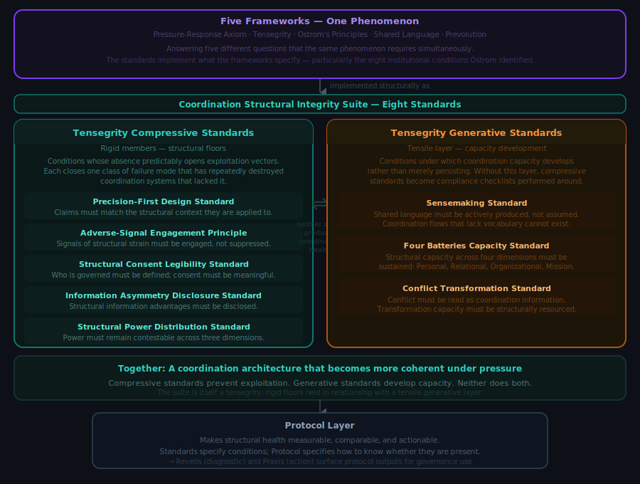
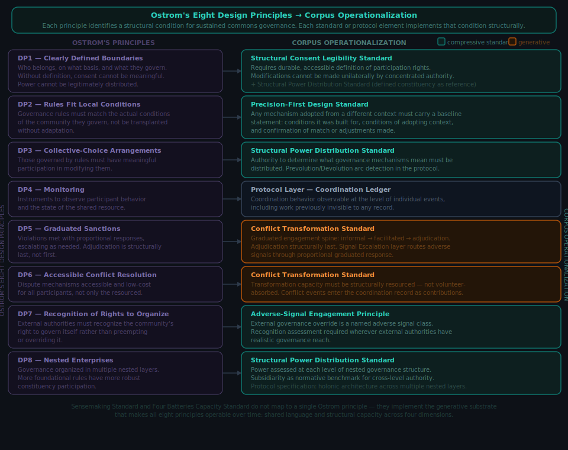

# Coordination Structural Integrity Suite

Distributed governance is struggling to find solid footing. DAOs and other coordination experiments have failed not because participants were malicious or incompetent, but because the systems lacked structural foundations. These standards specify those foundations.

This repository contains eight standards developed in the course of building the Proof of Coordination protocol: five Tensegrity Compressive Standards and three Tensegrity Generative Standards. Together they form the Coordination Structural Integrity Suite of the protocol's normative architecture.

<p align="center">

</p>

## Repository structure

```
tensegrity-suite/             Coordination Structural Integrity Suite
  overview/                   tensegrity architecture document and configurations primer
  prompts/                    suite-level audit prompts (compressive, generative, full)
  skills/                     suite-level Claude skill
  compressive/                five Tensegrity Compressive Standards
    standards/                the standard documents
    prompts/                  AI audit prompts, one subfolder per standard
    skills/                   Claude skills, one file per standard
  generative/                 three Tensegrity Generative Standards
    standards/                the standard documents
    prompts/                  AI assessment prompts, one subfolder per standard
    skills/                   Claude skills, one file per standard
```

## What these standards are

Coordination systems fail in predictable ways. The failures are structural: they happen because the systems lack structural floors, minimum conditions that, when absent, make exploitation and degradation predictable rather than merely possible.

The compressive standards specify those floors. Each standard in this repository is an instrument: a standalone specification of a structural requirement with verifiable conditions. They are not prescriptive workflows, style guides, or evaluation rubrics. The compressive standards specify what must not be violated; the generative standards specify what must be structurally present for coordination capacity to develop and be sustained. Neither type specifies how to organize.

## What these standards are not

The compressive standards are not complete coordination infrastructure on their own. They close exploitation vectors and prevent specific failure modes. Structural floors alone are not enough. A coordination system also needs generative capacity: the conditions under which participants can develop shared understanding and sustain the structural floors as coordination instruments rather than compliance checklists. The three Tensegrity Generative Standards in this repository address that generative layer.

Partial adoption is legitimate. Partial adoption claimed as full conformance is not. The adoption architecture section below specifies the three adoption categories and the structural exposure disclosure requirement for systems that claim accountability without holding the full Tensegrity Compressive Standards designation.

These standards do not specify governance outcomes. They specify structural conditions. What organizations do within those conditions is outside their scope.

## Who these standards are for

Every governance system that has failed believed it was adequate before it failed. FTX had governance documentation. Terra/Luna had economic theory. GravityDAO had values and processes. Every DAO that required emergency conflict transformation had a community that believed it had a community. The belief that structural failure modes do not apply to a specific system is not irrational from inside that system: it is the predictable output of the mechanisms those failure modes create. Organizations experiencing structural blindness do not experience it as blindness. They experience it as clarity.

These standards are designed primarily for organizations that do not currently believe they have a structural problem. Organizations already in crisis can use them, but the organizations most likely to benefit are the ones convinced they are doing governance correctly.

The reason is structural. The failure modes these standards address are most dangerous in the phase before they are visible. Structural power concentrates gradually, through drift, before it becomes capture. Consent erodes through accumulated friction before it becomes coercion. Adverse signals accumulate as dismissed noise before they become the record of a foreseeable failure. None of the protective work these standards enable is available after the failure is apparent. It is only available before.

Adopting these standards is not primarily an act of self-protection. It is a structural health claim made to others: funders, governance participants, counterparties, and future members who need to evaluate whether your coordination infrastructure is sound. An organization at any adoption tier has publicly verifiable evidence of its structural health, not a private belief that things are fine. That distinction matters most to the people evaluating from outside, and it holds regardless of what the organization believes about its own risk profile.

The "it won't happen to us" assumption is not something these standards argue against. It is something these standards make structurally legible. An organization with adoption-tier evidence demonstrating its power distribution, adverse signal engagement, and consent architecture has answered the question from its structure rather than from its confidence.

## The five Tensegrity Compressive Standards

**Precision-First Design Standard:** Requires that every element of a governed system increase the precision with which the system's dynamics can be observed, classified, and acted upon. Closes the gap between what a coordination system says it does and what it structurally does. Nine corollaries. Addresses Ostrom's second design principle at the standards level.

**Adverse-Signal Engagement Principle Core Standard:** Requires engagement with signals that contradict current models rather than suppression or reframing. Closes the gap between appearing to address problems and actually addressing them. Addresses Ostrom's design principles 5, 6, and 7 at the standards level.

**Structural Consent Legibility Standard:** Requires that consent to participation be structurally distinguishable from consent to specific terms, outcomes, and power arrangements. Three consent features: negotiated limits, bidirectional awareness, revocability. Addresses Ostrom's first design principle at the standards level.

**Information Asymmetry Classification Standard:** Requires classification and disclosure of the structural types of information asymmetry present in a coordination system. Six primary classes: positional, temporal, interpretive, relational, omission, complexity. Extension class framework for additional classes; Descriptive Capacity Asymmetry (differential linguistic-epistemic-ontological frameworks creating pre-interpretive perception gaps) is the first fully specified extension class.

**Structural Power Distribution Standard:** Requires that structural power arrangements be legible and contestable by participants who hold less of it. Three dimensions: coordination, authority, specialization. Addresses Ostrom's design principles 1, 3, and 8 at the standards level; cross-boundary detection architecture for DP8 remains an open design question.

## The three Tensegrity Generative Standards

**Sensemaking Standard:** Specifies what sensemaking must structurally provide for coordination to remain self-correcting. Five structural invariants: disruption-occasioned, particular-to-general relating, action-entangled, sufficiency-oriented, temporally structured. Three operational scales: intra-personal, inter-personal, witness-reception. The standard specifies structural conditions; it does not prescribe method.

**Four Batteries Capacity Standard:** Specifies the structural conditions under which four orthogonal capacity dimensions (Personal, Relational, Contribution, Mission) enable coordination surplus rather than merely preventing failure. Each battery operates across two independent dimensions: charge (cyclical, maintainable) and developmental state (permanent until transformed through integration events). Specifies depletion archetypes, generative archetypes, and structural connections to each of the five Tensegrity Compressive Standards.

**Conflict Transformation Standard:** Specifies the structural conditions under which a coordination system develops and sustains conflict transformation capacity. Five structural invariants: conflict legibility, graduated engagement architecture, proactive disposition enablement, transformation capacity provision, recognition as coordination work. Three operational scales: intra-organizational, inter-organizational, protocol-level. Addresses Ostrom's design principles 4, 5, and 6 at the standards level. Primary empirical grounding: GravityDAO operated for seven years, was universally recognized as necessary, and failed entirely because no existing coordination infrastructure provided a mechanism to recognize conflict transformation as coordination work. The standard addresses that structural gap directly.

<p align="center">

</p>

## Adoption architecture

Each standard in this repository carries a five-tier adoption framework that describes the organization's structural accountability for the requirement the standard specifies. The tiers are consistent in structure across all eight standards, though the specific operational requirements differ per standard.

**Tier 1, Assessed.** The organization has mapped its documents or operations against the standard. A deficit inventory exists. No process changes are required at this tier. No conformance claim is made.

**Tier 2, Operational.** The organization has defined processes for identifying and tracking deficits. Deficits are recorded durably with document, location, deficit type, and date. The record is maintained as changes occur.

**Tier 3, Instrumented.** The organization applies the standard at design time. No element in scope is considered complete until the standard's requirements are met. The organization can report its current compliance state without a dedicated review cycle.

**Tier 4, Accountable.** Includes all Tier 3 requirements plus closed governance loop architecture. Detected deficits produce mandatory governance responses, and the absence of a response is itself structurally visible.

**Tier 5, Auditable.** Includes all Tier 4 requirements plus independent auditability. The deficit record must be verifiable by an independent auditor for both presence (each recorded deficit was identified) and completeness (all identified deficits are in the record).

Tiers 1 through 3 are normatively specified across all five Tensegrity Compressive Standards. Tiers 4 and 5 are specified in architecture; normative completion is pending pilot data.

## Adoption claims

Three adoption categories govern how adoption is described. They are mutually exclusive and exhaustive: any system that has adopted one or more standards falls into exactly one category at any given time.

**Adoption level.** A system that has adopted one or more standards at any tier has an adoption level. Adoption level is a developmental description, not a conformance claim. It is expressed per standard: "this system has adopted the Adverse Signal Engagement Principle Core Standard at Tier 2 (Operational)." No general conformance claim follows from an adoption level. An adoption level is not a credential; it describes where a system is in its developmental trajectory.

**Full Tensegrity Compressive Standards designation.** A system that has adopted all five Tensegrity Compressive Standards at Tier 4 (Accountable) or above holds the full Tensegrity Compressive Standards designation. This is the only category that carries a conformance claim. The designation is all-or-nothing: Tier 4 across four standards and Tier 3 on the fifth does not satisfy it. The designation is descriptive, not a credential: it names an observable structural state.

**Structural exposure disclosure.** A system that claims structural accountability without holding the full designation must produce a structural exposure disclosure in place of a conformance claim. A substantive disclosure contains four elements: it names each absent or sub-Tier-4 standard by its full canonical name; it describes in plain language the specific failure mode class that standard addresses and what becomes structurally undetectable in its absence; it states a self-assessed exposure level (low, medium, or high) with a rationale an independent reader can evaluate; and it names any compensating controls with their mechanism and adequacy basis. Where no compensating controls exist, the disclosure says so explicitly.

A disclosure that names absent standards without the failure mode description, exposure assessment, and compensating control inventory is form-compliant but not substantive. Form-compliant disclosures that omit the required content are precision deficits under the Precision-First Design Standard and are subject to the same adverse signal processing as any other precision failure.

Partial adoption is legitimate developmental progress. Partial adoption claimed as full conformance is not. The structural exposure disclosure is the mechanism that keeps that distinction legible to outside observers.

## Relationship to the Proof of Coordination protocol

<p align="center">

</p>

These standards are the normative foundation for the Proof of Coordination protocol, which builds measurement infrastructure for coordination capacity. The standards can be adopted independently of the full protocol. The protocol depends on them structurally.

Full protocol documentation will be linked here as it is released.

## Licensing

- **Specifications** (standards documents in this repository): Licensed under Creative Commons Attribution 4.0 International (CC BY 4.0). See `LICENSE-SPEC`.
- **Code and software artifacts** (now or future: examples, scripts, tests, reference implementations): Licensed under Apache License 2.0. See `LICENSE`.

## Changelog

2026-03-31: Added two visualizations: (1) Five Frameworks — One Phenomenon, showing the structural logic of the suite and its relationship to the framework layer; (2) Ostrom's Eight Design Principles mapped to corpus operationalization. Both SVGs in images/ subfolder.

2026-03-28: Repository restructured into nested suite/compressive/ and suite/generative/ folders. Subfolder READMEs added for suite/, compressive/, and generative/. Title updated to full suite name. Generative standards heading corrected to include full layer name. Licensing section path pattern generalized.

2026-03-28: Added "Adoption architecture" section (five-tier framework, tier definitions) and "Adoption claims" section (three adoption categories: adoption level, full Tensegrity Compressive Standards designation, structural exposure disclosure). Updated "What these standards are not" partial adoption sentence to forward-reference the new adoption architecture section rather than giving a weaker standalone summary.
